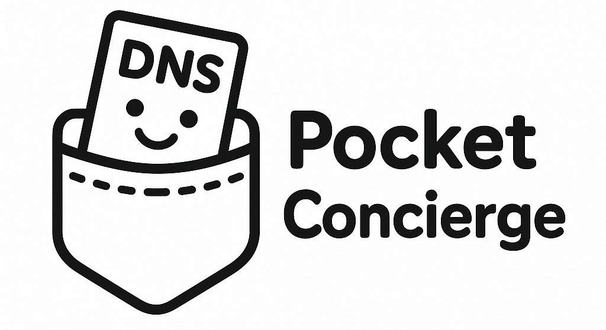

# 🏨 Pocket Concierge

<p align="center">
  
</p>

A lightweight, high-performance DNS server designed specifically for home networks. Pocket Concierge acts as your personal network concierge, providing local hostname resolution, DNS caching, and secure upstream DNS forwarding with support for DNS-over-HTTPS (DoH) and DNS-over-TLS (DoT).

## ✨ Features

- **🏠 Local Host Resolution**: Configure custom hostnames for your home devices (e.g., `laptop.home`, `printer.home`)
- **🫸 Domain Blocking**: Block unwanted domains (ads, trackers, malware) with configurable block-lists
- **🔐 Secure DNS**: Support for DNS-over-HTTPS (DoH) and DNS-over-TLS (DoT) upstream resolvers
- **⚡ High Performance**: Built-in DNS caching with configurable cache size and TTL
- **🔄 Smart Fallback**: Multiple upstream DNS servers with automatic failover
- **📝 Easy Configuration**: Simple YAML configuration file
- **🌐 IPv4 & IPv6**: Full support for both IPv4 and IPv6 addresses
- **📊 Monitoring**: Built-in benchmarking and load testing tools
- **🛡️ Reliable**: Graceful shutdown and error handling

## 🚀 Quick Start

### Prerequisites

- Go 1.24 or later
- A home network where you can configure DNS settings

### Installation

1. **Clone the repository:**

   ```bash
   git clone https://github.com/risadams/Pocket-Concierge.git
   cd Pocket-Concierge
   ```

2. **Build the application:**

   ```bash
   make build
   ```

   Or build manually:

   ```bash
   go build -o build/pocketconcierge ./cmd/pocketconcierge
   ```

3. **Create your configuration:**

   ```bash
   cp configs/example.yaml config.yaml
   ```

   Edit `config.yaml` to match your network setup.

4. **Run the server:**

   ```bash
   ./build/pocketconcierge
   ```

   Or specify a custom config file:

   ```bash
   ./build/pocketconcierge /path/to/your/config.yaml
   ```

### Quick Test

Test your DNS server with the included test utility:

```bash
# Uses port from config.yaml automatically
go run test-dns.go laptop.home

# Or specify custom server and port
go run test-dns.go laptop.home 127.0.0.1:8053
```

## ⚙️ Configuration

Pocket Concierge uses a YAML configuration file. Here's a basic example:

```yaml
server:
  port: 8053  # All deployment scripts automatically use this port
  address: "127.0.0.1"

dns:
  ttl: 300
  enable_recursion: true
  cache_size: 10000
  block_list:
    - "ads.example.com"
    - "tracker.badsite.com"
    - "malware.evil.net"

upstream:
  # DNS-over-HTTPS
  - name: "ControlD DoH Primary"
    address: "dns.controld.com"
    protocol: "https"
    port: 443
    path: "/MY_CTRLD_ENDPOINT_RESOLVER"
    verify: true

  # Fallback DNS
  - name: "Cloudflare"
    address: "1.1.1.1"
    protocol: "udp"
    port: 53
    verify: false

log_level: "info"
home_dns_domain: "home"

hosts:
  - hostname: "laptop"
    ipv4:
      - "192.168.1.101"
    ipv6:
      - "fe80::1234:5678:90ab:cdef"
  
  - hostname: "printer"
    ipv4:
      - "192.168.1.53"
```

### Configuration Options

#### Server Settings

- `server.port`: Port to listen on (default: 8053). All deployment scripts (Docker, Makefile, benchmarks) automatically read this value.
- `server.address`: IP address to bind to (default: 127.0.0.1)

#### DNS Settings

- `dns.ttl`: Default TTL for DNS responses in seconds
- `dns.enable_recursion`: Enable recursive DNS queries
- `dns.cache_size`: Maximum number of cached DNS entries

#### Upstream Servers

Configure multiple upstream DNS servers with different protocols:

- `protocol`: `udp`, `tcp`, `tls`, or `https`
- `verify`: Enable certificate verification for secure protocols
- `path`: Required for DNS-over-HTTPS

#### Local Hosts

- `home_dns_domain`: Default domain suffix for simple hostnames
- `hosts`: Array of local hostname mappings

## 🔧 Port Configuration

All deployment and testing scripts automatically read the port from your `config.yaml` file. When you change the port in the configuration, it's automatically used by:

- **Docker Compose**: Reads port via environment variables
- **Makefile**: Extracts port using `awk` and uses it for container mappings  
- **Deployment scripts**: `deploy.ps1` and `deploy.sh` parse config and use the correct port
- **Benchmark script**: `benchmark.ps1` reads config to test the right port
- **Test utilities**: `test-dns.go` defaults to config port if no server specified

### Manual Port Sync for Docker Compose

If needed, you can manually sync the port to environment variables:

```bash
# Windows PowerShell
.\set-port-env.ps1

# Linux/macOS
./set-port-env.sh
```

These scripts update the `.env` file with `POCKET_CONCIERGE_PORT` from your config.

## 🛠️ Development

### Building

```bash
# Build for current platform
make build

# Build for all platforms
make build-all

# Build with debug info
make build-debug
```

### Testing

```bash
# Run all tests
make test

# Run tests with coverage
make test-coverage

# Run integration tests
make test-integration

# Run benchmarks
make benchmark
```

### Code Quality

```bash
# Format code
make fmt

# Run linter
make lint

# Security scan
make security
```

## 📋 Available Commands

### Main Application

- `./build/pocketconcierge [config.yaml]` - Start the DNS server

### Utilities

- `go run test-dns.go <hostname> [server:port] [record-type]` - Test DNS resolution
- `./build/benchmark` - Run performance benchmarks
- `./build/loadtest` - Run load tests

### Make Targets

- `make help` - Show all available commands
- `make build` - Build the application
- `make test` - Run tests
- `make clean` - Clean build artifacts
- `make install` - Install to system
- `make docker` - Build Docker image

## 🏠 Home Network Setup

1. **Configure your router** to use Pocket Concierge as the primary DNS server
2. **Set static IP** for the machine running Pocket Concierge
3. **Configure local hostnames** in the config file for your devices
4. **Test connectivity** using the test utility

### Example Home Setup

```yaml
hosts:
  - hostname: "router"
    ipv4: ["192.168.1.1"]
  
  - hostname: "nas"
    ipv4: ["192.168.1.10"]
  
  - hostname: "laptop"
    ipv4: ["192.168.1.100"]
  
  - hostname: "desktop"
    ipv4: ["192.168.1.101"]
  
  - hostname: "phone"
    ipv4: ["192.168.1.150"]
  
  - hostname: "printer"
    ipv4: ["192.168.1.200"]
```

Now you can access your devices using friendly names:

- `http://nas.home` instead of `http://192.168.1.10`
- `ssh user@laptop.home` instead of `ssh user@192.168.1.100`

## 🔧 Troubleshooting

### Common Issues

1. **Port 53 already in use**
   - Change the port in config.yaml to something else (e.g., 9053)
   - All deployment scripts automatically use the configured port
   - Stop other DNS services if running on port 53

2. **DNS queries not being resolved**
   - Check that your router/devices are configured to use Pocket Concierge
   - Verify the server is running and listening on the correct port
   - Test with the included test utility

3. **Docker port conflicts**
   - Update the port in config.yaml - Docker Compose will use it automatically
   - Or set POCKET_CONCIERGE_PORT environment variable
   - Run `./set-port-env.ps1` (Windows) or `./set-port-env.sh` (Linux) to sync ports

4. **Upstream DNS failures**
   - Check your internet connection
   - Verify upstream server configurations
   - Try fallback to traditional DNS servers

### Debug Mode

Run with verbose logging:

```yaml
log_level: "debug"
```

### Network Testing

```bash
# Test local resolution (automatically uses port from config.yaml)
go run test-dns.go laptop.home

# Test external resolution 
go run test-dns.go google.com

# Test IPv6
go run test-dns.go laptop.home "" AAAA

# Or specify custom server and port explicitly
go run test-dns.go laptop.home 127.0.0.1:8053
```

## 🔒 Security Features

- **DNS-over-HTTPS (DoH)**: Encrypted DNS queries to upstream servers
- **DNS-over-TLS (DoT)**: TLS-encrypted DNS for privacy
- **Certificate Verification**: Validates upstream server certificates
- **Local-only Bindings**: Binds to localhost by default for security

## 📊 Performance

Pocket Concierge is designed for high performance:

- **Memory efficient caching** with configurable limits
- **Concurrent request handling** using Go's goroutines
- **Smart upstream selection** with failover
- **Minimal latency** for local hostname resolution

### Benchmarking

Run included benchmarks:

```bash
# Build and run benchmark tool
make build
./build/benchmark

# Or use PowerShell script
.\benchmark.ps1
```

## 🤝 Contributing

1. Fork the repository
2. Create your feature branch (`git checkout -b feature/amazing-feature`)
3. Commit your changes (`git commit -m 'Add some amazing feature'`)
4. Push to the branch (`git push origin feature/amazing-feature`)
5. Open a Pull Request

### Development Guidelines

- Follow Go best practices
- Add tests for new features
- Update documentation as needed
- Run `make lint` before submitting

## 📄 License

This project is licensed under the MIT License - see the [LICENSE](LICENSE) file for details.

## 🙏 Acknowledgments

- Built with [miekg/dns](https://github.com/miekg/dns) - excellent DNS library for Go
- Inspired by home network automation and privacy concerns
- Thanks to the Go community for excellent tooling and libraries

## 📞 Support

- 🐛 **Issues**: [GitHub Issues](https://github.com/risadams/Pocket-Concierge/issues)
- 💬 **Discussions**: [GitHub Discussions](https://github.com/risadams/Pocket-Concierge/discussions)

---

**Pocket Concierge** - Your personal home network DNS concierge 🏨✨
